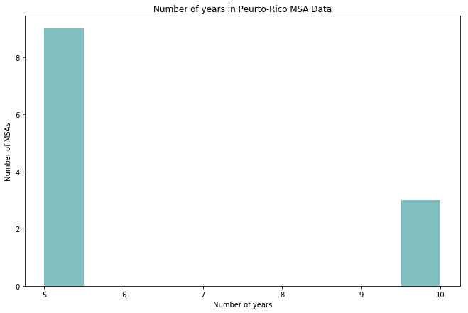

Listed below are the gaps that we've identified in the extracted data, alongside the design decisions we made for re-formatting

**Crime Data (FBI Uniform Crime Reporting Program):**

* Some MSA had crime statistics within multiple cities while the others only had one. We decided to define our city features as those that come from the largest city (by population) so that each MSA had one set of city statistics


* Not all MSA had 100% reporting rate of data. For those MSAs that did not have 100% reporting, an estimated total was reported. We used the estimated total rather than the actual variables so that all of our data represented the entire MSA (either actual or estimated).


* Crime data did not have a numeric ID for MSA. We initially considered using a cross-walk to translate the MSA descriptions to IDs but decided otherwise since IDs changed over time. MSA desciptions were a concatenation of the key cities followed by the state name. There were instances where an MSA was part of multiple states. We also observed that MSA names change over time. For accurate and unique identification, we created a unique **join_key** for each MSA. To create the join key, we extracted the first city name from the MSA description and concantenated it with the state abbreviation (which was also a part of the MSA description). We then used this **join_key along with year to merge the three data sets** to create one complete data frame for subsequent analysis.

**Census Data:**

We created custom tables at the M.S.A level from the census database and extracted the files in Excel format. These files were merged into a census dataframe, which was later joined back to the Crime Dataset

* Around 4% of MSA descriptions differed from what we obtained from the FBI Database. These cases were manually updated.  


<div>
<style scoped>
    .dataframe tbody tr th:only-of-type {
        vertical-align: middle;
    }

    .dataframe tbody tr th {
        vertical-align: top;
    }

    .dataframe thead th {
        text-align: right;
    }
</style>
<table border="1" class="dataframe">
  <thead>
    <tr style="text-align: right;">
      <th></th>
      <th>city_key</th>
      <th>state_key</th>
      <th>unemp_16_ovr</th>
      <th>unemp_16_19</th>
      <th>unemp_female</th>
      <th>year</th>
    </tr>
  </thead>
  <tbody>
    <tr>
      <th>0</th>
      <td>Abilene</td>
      <td>TX</td>
      <td>6.6</td>
      <td>23.1</td>
      <td>5.2</td>
      <td>2006</td>
    </tr>
    <tr>
      <th>367</th>
      <td>Abilene</td>
      <td>TX</td>
      <td>6.6</td>
      <td>23.1</td>
      <td>5.2</td>
      <td>2007</td>
    </tr>
    <tr>
      <th>734</th>
      <td>Abilene</td>
      <td>TX</td>
      <td>6.6</td>
      <td>23.1</td>
      <td>5.2</td>
      <td>2008</td>
    </tr>
    <tr>
      <th>1101</th>
      <td>Abilene</td>
      <td>TX</td>
      <td>6.6</td>
      <td>23.1</td>
      <td>5.2</td>
      <td>2009</td>
    </tr>
    <tr>
      <th>1468</th>
      <td>Abilene</td>
      <td>TX</td>
      <td>6.6</td>
      <td>23.1</td>
      <td>5.2</td>
      <td>2010</td>
    </tr>
  </tbody>
</table>
</div>


<div>
<style scoped>
    .dataframe tbody tr th:only-of-type {
        vertical-align: middle;
    }

    .dataframe tbody tr th {
        vertical-align: top;
    }

    .dataframe thead th {
        text-align: right;
    }
</style>
<table border="1" class="dataframe">
  <thead>
    <tr style="text-align: right;">
      <th></th>
      <th>city_key</th>
      <th>state_key</th>
      <th>median_age</th>
      <th>sex_ratio</th>
      <th>male_pop</th>
      <th>female_pop</th>
      <th>pop_15_19</th>
      <th>pop_20_24</th>
      <th>male_pop_20_24</th>
      <th>year</th>
    </tr>
  </thead>
  <tbody>
    <tr>
      <th>0</th>
      <td>Abilene</td>
      <td>TX</td>
      <td>34.4</td>
      <td>99.1</td>
      <td>0.497717</td>
      <td>0.502283</td>
      <td>8.3</td>
      <td>8.7</td>
      <td>10.2</td>
      <td>2006</td>
    </tr>
    <tr>
      <th>367</th>
      <td>Abilene</td>
      <td>TX</td>
      <td>34.9</td>
      <td>99.1</td>
      <td>0.497777</td>
      <td>0.502223</td>
      <td>9.5</td>
      <td>7.7</td>
      <td>8.6</td>
      <td>2007</td>
    </tr>
    <tr>
      <th>736</th>
      <td>Abilene</td>
      <td>TX</td>
      <td>34.6</td>
      <td>101.0</td>
      <td>0.502381</td>
      <td>0.497619</td>
      <td>9.2</td>
      <td>7.6</td>
      <td>8.9</td>
      <td>2008</td>
    </tr>
    <tr>
      <th>1105</th>
      <td>Abilene</td>
      <td>TX</td>
      <td>33.2</td>
      <td>97.0</td>
      <td>0.492269</td>
      <td>0.507731</td>
      <td>7.9</td>
      <td>9.0</td>
      <td>9.6</td>
      <td>2009</td>
    </tr>
    <tr>
      <th>1479</th>
      <td>Abilene</td>
      <td>TX</td>
      <td>NaN</td>
      <td>NaN</td>
      <td>0.501355</td>
      <td>0.498645</td>
      <td>7.3</td>
      <td>9.5</td>
      <td>9.9</td>
      <td>2010</td>
    </tr>
  </tbody>
</table>
</div>


<div>
<style scoped>
    .dataframe tbody tr th:only-of-type {
        vertical-align: middle;
    }

    .dataframe tbody tr th {
        vertical-align: top;
    }

    .dataframe thead th {
        text-align: right;
    }
</style>
<table border="1" class="dataframe">
  <thead>
    <tr style="text-align: right;">
      <th></th>
      <th>inc_lt10</th>
      <th>inc_10_15</th>
      <th>inc_15_19</th>
      <th>inc_20_24</th>
      <th>inc_25_29</th>
      <th>inc_30_34</th>
      <th>inc_35_39</th>
      <th>inc_40_44</th>
      <th>inc_45_49</th>
      <th>inc_50_59</th>
      <th>inc_60_74</th>
      <th>inc_75_99</th>
      <th>inc_100_124</th>
      <th>inc_125_149</th>
      <th>inc_150_199</th>
      <th>inc_gt_200</th>
      <th>city_key</th>
      <th>state_key</th>
      <th>year</th>
    </tr>
  </thead>
  <tbody>
    <tr>
      <th>0</th>
      <td>0.066006</td>
      <td>0.039355</td>
      <td>0.191044</td>
      <td>0.142857</td>
      <td>0.034552</td>
      <td>0.051751</td>
      <td>0.094980</td>
      <td>0.044159</td>
      <td>0.004803</td>
      <td>0.138829</td>
      <td>0.060738</td>
      <td>0.099628</td>
      <td>0.004029</td>
      <td>0.006508</td>
      <td>0.018748</td>
      <td>0.002014</td>
      <td>Abilene</td>
      <td>TX</td>
      <td>2006</td>
    </tr>
    <tr>
      <th>1</th>
      <td>0.042883</td>
      <td>0.102766</td>
      <td>0.078153</td>
      <td>0.191829</td>
      <td>0.056077</td>
      <td>0.063436</td>
      <td>0.136514</td>
      <td>0.011165</td>
      <td>0.071048</td>
      <td>0.108094</td>
      <td>0.062928</td>
      <td>0.046435</td>
      <td>0.025121</td>
      <td>0.003552</td>
      <td>0.000000</td>
      <td>0.000000</td>
      <td>Albany</td>
      <td>NY</td>
      <td>2006</td>
    </tr>
    <tr>
      <th>2</th>
      <td>0.111215</td>
      <td>0.064565</td>
      <td>0.078066</td>
      <td>0.069276</td>
      <td>0.056352</td>
      <td>0.080003</td>
      <td>0.071902</td>
      <td>0.061101</td>
      <td>0.054006</td>
      <td>0.094082</td>
      <td>0.101140</td>
      <td>0.101661</td>
      <td>0.034098</td>
      <td>0.007486</td>
      <td>0.009591</td>
      <td>0.005456</td>
      <td>Albuquerque</td>
      <td>NM</td>
      <td>2006</td>
    </tr>
    <tr>
      <th>3</th>
      <td>0.150833</td>
      <td>0.063611</td>
      <td>0.084792</td>
      <td>0.084514</td>
      <td>0.105903</td>
      <td>0.057778</td>
      <td>0.043542</td>
      <td>0.024583</td>
      <td>0.080417</td>
      <td>0.095417</td>
      <td>0.075556</td>
      <td>0.068958</td>
      <td>0.042639</td>
      <td>0.000000</td>
      <td>0.021458</td>
      <td>0.000000</td>
      <td>Allentown</td>
      <td>PA-NJ</td>
      <td>2006</td>
    </tr>
    <tr>
      <th>4</th>
      <td>0.084392</td>
      <td>0.086299</td>
      <td>0.077275</td>
      <td>0.135104</td>
      <td>0.043213</td>
      <td>0.134596</td>
      <td>0.061642</td>
      <td>0.051856</td>
      <td>0.037239</td>
      <td>0.120742</td>
      <td>0.054270</td>
      <td>0.070285</td>
      <td>0.011185</td>
      <td>0.022496</td>
      <td>0.000000</td>
      <td>0.009405</td>
      <td>Amarillo</td>
      <td>TX</td>
      <td>2006</td>
    </tr>
  </tbody>
</table>
</div>


<div>
<style scoped>
    .dataframe tbody tr th:only-of-type {
        vertical-align: middle;
    }

    .dataframe tbody tr th {
        vertical-align: top;
    }

    .dataframe thead th {
        text-align: right;
    }
</style>
<table border="1" class="dataframe">
  <thead>
    <tr style="text-align: right;">
      <th></th>
      <th>gini</th>
      <th>city_key</th>
      <th>state_key</th>
      <th>year</th>
    </tr>
  </thead>
  <tbody>
    <tr>
      <th>0</th>
      <td>0.443</td>
      <td>Abilene</td>
      <td>TX</td>
      <td>2006</td>
    </tr>
    <tr>
      <th>1</th>
      <td>0.533</td>
      <td>Aguadilla</td>
      <td>PR</td>
      <td>2006</td>
    </tr>
    <tr>
      <th>2</th>
      <td>0.445</td>
      <td>Akron</td>
      <td>OH</td>
      <td>2006</td>
    </tr>
    <tr>
      <th>3</th>
      <td>0.481</td>
      <td>Albany</td>
      <td>GA</td>
      <td>2006</td>
    </tr>
    <tr>
      <th>4</th>
      <td>0.405</td>
      <td>Albany</td>
      <td>NY</td>
      <td>2006</td>
    </tr>
  </tbody>
</table>
</div>


<div>
<style scoped>
    .dataframe tbody tr th:only-of-type {
        vertical-align: middle;
    }

    .dataframe tbody tr th {
        vertical-align: top;
    }

    .dataframe thead th {
        text-align: right;
    }
</style>
<table border="1" class="dataframe">
  <thead>
    <tr style="text-align: right;">
      <th></th>
      <th>under_18_pov</th>
      <th>18_64_pov</th>
      <th>male_pov</th>
      <th>female_pov</th>
      <th>city_key</th>
      <th>state_key</th>
      <th>year</th>
    </tr>
  </thead>
  <tbody>
    <tr>
      <th>0</th>
      <td>20.4</td>
      <td>14.9</td>
      <td>15.5</td>
      <td>16.1</td>
      <td>Abilene</td>
      <td>TX</td>
      <td>2006</td>
    </tr>
    <tr>
      <th>1</th>
      <td>67.4</td>
      <td>53.4</td>
      <td>56.3</td>
      <td>57.6</td>
      <td>Aguadilla</td>
      <td>PR</td>
      <td>2006</td>
    </tr>
    <tr>
      <th>2</th>
      <td>15.7</td>
      <td>12.5</td>
      <td>10.7</td>
      <td>14.6</td>
      <td>Akron</td>
      <td>OH</td>
      <td>2006</td>
    </tr>
    <tr>
      <th>3</th>
      <td>31.0</td>
      <td>20.7</td>
      <td>20.7</td>
      <td>24.7</td>
      <td>Albany</td>
      <td>GA</td>
      <td>2006</td>
    </tr>
    <tr>
      <th>4</th>
      <td>13.2</td>
      <td>8.6</td>
      <td>8.7</td>
      <td>10.9</td>
      <td>Albany</td>
      <td>NY</td>
      <td>2006</td>
    </tr>
  </tbody>
</table>
</div>


<div>
<style scoped>
    .dataframe tbody tr th:only-of-type {
        vertical-align: middle;
    }

    .dataframe tbody tr th {
        vertical-align: top;
    }

    .dataframe thead th {
        text-align: right;
    }
</style>
<table border="1" class="dataframe">
  <thead>
    <tr style="text-align: right;">
      <th></th>
      <th>city_key</th>
      <th>state_key</th>
      <th>married_house</th>
      <th>female_house</th>
      <th>male_house</th>
      <th>year</th>
    </tr>
  </thead>
  <tbody>
    <tr>
      <th>0</th>
      <td>Abilene</td>
      <td>TX</td>
      <td>0.661882</td>
      <td>0.253355</td>
      <td>0.007038</td>
      <td>2006</td>
    </tr>
    <tr>
      <th>1</th>
      <td>Aguadilla</td>
      <td>PR</td>
      <td>0.625417</td>
      <td>0.324838</td>
      <td>0.004308</td>
      <td>2006</td>
    </tr>
    <tr>
      <th>2</th>
      <td>Akron</td>
      <td>OH</td>
      <td>0.686886</td>
      <td>0.246946</td>
      <td>0.008047</td>
      <td>2006</td>
    </tr>
    <tr>
      <th>3</th>
      <td>Albany</td>
      <td>GA</td>
      <td>0.505709</td>
      <td>0.429540</td>
      <td>0.000000</td>
      <td>2006</td>
    </tr>
    <tr>
      <th>4</th>
      <td>Albany</td>
      <td>NY</td>
      <td>0.668823</td>
      <td>0.251285</td>
      <td>0.013663</td>
      <td>2006</td>
    </tr>
  </tbody>
</table>
</div>


<div>
<style scoped>
    .dataframe tbody tr th:only-of-type {
        vertical-align: middle;
    }

    .dataframe tbody tr th {
        vertical-align: top;
    }

    .dataframe thead th {
        text-align: right;
    }
</style>
<table border="1" class="dataframe">
  <thead>
    <tr style="text-align: right;">
      <th></th>
      <th>no_hs_18_24</th>
      <th>hs_18_24</th>
      <th>no_9th_25_ovr</th>
      <th>no_hs_25_ovr</th>
      <th>hs_25_ovr</th>
      <th>city_key</th>
      <th>state_key</th>
      <th>year</th>
    </tr>
  </thead>
  <tbody>
    <tr>
      <th>0</th>
      <td>10.8</td>
      <td>30.2</td>
      <td>7.5</td>
      <td>14.5</td>
      <td>28.6</td>
      <td>Abilene</td>
      <td>TX</td>
      <td>2006</td>
    </tr>
    <tr>
      <th>1</th>
      <td>23.4</td>
      <td>30.6</td>
      <td>32.7</td>
      <td>11.7</td>
      <td>25.0</td>
      <td>Aguadilla</td>
      <td>PR</td>
      <td>2006</td>
    </tr>
    <tr>
      <th>2</th>
      <td>11.6</td>
      <td>34.1</td>
      <td>2.4</td>
      <td>8.9</td>
      <td>34.4</td>
      <td>Akron</td>
      <td>OH</td>
      <td>2006</td>
    </tr>
    <tr>
      <th>3</th>
      <td>29.1</td>
      <td>22.1</td>
      <td>7.0</td>
      <td>12.2</td>
      <td>31.5</td>
      <td>Albany</td>
      <td>GA</td>
      <td>2006</td>
    </tr>
    <tr>
      <th>4</th>
      <td>11.9</td>
      <td>29.7</td>
      <td>3.2</td>
      <td>6.9</td>
      <td>30.5</td>
      <td>Albany</td>
      <td>NY</td>
      <td>2006</td>
    </tr>
  </tbody>
</table>
</div>


<div>
<style scoped>
    .dataframe tbody tr th:only-of-type {
        vertical-align: middle;
    }

    .dataframe tbody tr th {
        vertical-align: top;
    }

    .dataframe thead th {
        text-align: right;
    }
</style>
<table border="1" class="dataframe">
  <thead>
    <tr style="text-align: right;">
      <th></th>
      <th>city_key</th>
      <th>state_key</th>
      <th>white</th>
      <th>black</th>
      <th>asian</th>
      <th>year</th>
    </tr>
  </thead>
  <tbody>
    <tr>
      <th>0</th>
      <td>Abilene</td>
      <td>TX</td>
      <td>0.741838</td>
      <td>0.068295</td>
      <td>0.014292</td>
      <td>2006</td>
    </tr>
    <tr>
      <th>1</th>
      <td>Aguadilla</td>
      <td>PR</td>
      <td>0.896527</td>
      <td>0.019961</td>
      <td>0.000758</td>
      <td>2006</td>
    </tr>
    <tr>
      <th>2</th>
      <td>Akron</td>
      <td>OH</td>
      <td>0.844866</td>
      <td>0.116880</td>
      <td>0.017715</td>
      <td>2006</td>
    </tr>
    <tr>
      <th>3</th>
      <td>Albany</td>
      <td>GA</td>
      <td>0.485957</td>
      <td>0.494136</td>
      <td>0.006355</td>
      <td>2006</td>
    </tr>
    <tr>
      <th>4</th>
      <td>Albany</td>
      <td>NY</td>
      <td>0.867237</td>
      <td>0.070216</td>
      <td>0.030761</td>
      <td>2006</td>
    </tr>
  </tbody>
</table>
</div>


    '\n\nHousehold had ones where it looks like there may be mismatches but code below checked it\n\nCode to check merges\nnames = census_df.loc[census_df._merge != "both", [\'city_key\', \'state_key\', \'_merge\']]\nnames = names.sort_values[\'city_key\', \'state_key\']\nnames = names.drop_duplicates()\nprint(names.shape[0])\nnames.head(50)\n'


<div>
<style scoped>
    .dataframe tbody tr th:only-of-type {
        vertical-align: middle;
    }

    .dataframe tbody tr th {
        vertical-align: top;
    }

    .dataframe thead th {
        text-align: right;
    }
</style>
<table border="1" class="dataframe">
  <thead>
    <tr style="text-align: right;">
      <th></th>
      <th>city_key</th>
      <th>state_key</th>
      <th>white</th>
      <th>black</th>
      <th>asian</th>
      <th>year</th>
      <th>unemp_16_ovr</th>
      <th>unemp_16_19</th>
      <th>unemp_female</th>
      <th>median_age</th>
      <th>...</th>
      <th>hs_18_24</th>
      <th>no_9th_25_ovr</th>
      <th>no_hs_25_ovr</th>
      <th>hs_25_ovr</th>
      <th>gini</th>
      <th>under_18_pov</th>
      <th>18_64_pov</th>
      <th>male_pov</th>
      <th>female_pov</th>
      <th>real_pc_gdp</th>
    </tr>
  </thead>
  <tbody>
    <tr>
      <th>0</th>
      <td>Abilene</td>
      <td>TX</td>
      <td>0.741838</td>
      <td>0.068295</td>
      <td>0.014292</td>
      <td>2006</td>
      <td>6.6</td>
      <td>23.1</td>
      <td>5.2</td>
      <td>34.4</td>
      <td>...</td>
      <td>30.2</td>
      <td>7.5</td>
      <td>14.5</td>
      <td>28.6</td>
      <td>0.443</td>
      <td>20.4</td>
      <td>14.9</td>
      <td>15.5</td>
      <td>16.1</td>
      <td>33978.0</td>
    </tr>
    <tr>
      <th>1</th>
      <td>Aguadilla</td>
      <td>PR</td>
      <td>0.896527</td>
      <td>0.019961</td>
      <td>0.000758</td>
      <td>2006</td>
      <td>20.6</td>
      <td>56.8</td>
      <td>19.1</td>
      <td>35.3</td>
      <td>...</td>
      <td>30.6</td>
      <td>32.7</td>
      <td>11.7</td>
      <td>25.0</td>
      <td>0.533</td>
      <td>67.4</td>
      <td>53.4</td>
      <td>56.3</td>
      <td>57.6</td>
      <td>NaN</td>
    </tr>
    <tr>
      <th>2</th>
      <td>Akron</td>
      <td>OH</td>
      <td>0.844866</td>
      <td>0.116880</td>
      <td>0.017715</td>
      <td>2006</td>
      <td>6.3</td>
      <td>23.0</td>
      <td>4.8</td>
      <td>37.9</td>
      <td>...</td>
      <td>34.1</td>
      <td>2.4</td>
      <td>8.9</td>
      <td>34.4</td>
      <td>0.445</td>
      <td>15.7</td>
      <td>12.5</td>
      <td>10.7</td>
      <td>14.6</td>
      <td>42081.0</td>
    </tr>
    <tr>
      <th>3</th>
      <td>Albany</td>
      <td>GA</td>
      <td>0.485957</td>
      <td>0.494136</td>
      <td>0.006355</td>
      <td>2006</td>
      <td>10.0</td>
      <td>31.0</td>
      <td>10.1</td>
      <td>34.3</td>
      <td>...</td>
      <td>22.1</td>
      <td>7.0</td>
      <td>12.2</td>
      <td>31.5</td>
      <td>0.481</td>
      <td>31.0</td>
      <td>20.7</td>
      <td>20.7</td>
      <td>24.7</td>
      <td>32657.0</td>
    </tr>
    <tr>
      <th>4</th>
      <td>Albany</td>
      <td>NY</td>
      <td>0.867237</td>
      <td>0.070216</td>
      <td>0.030761</td>
      <td>2006</td>
      <td>5.4</td>
      <td>16.8</td>
      <td>4.4</td>
      <td>38.2</td>
      <td>...</td>
      <td>29.7</td>
      <td>3.2</td>
      <td>6.9</td>
      <td>30.5</td>
      <td>0.405</td>
      <td>13.2</td>
      <td>8.6</td>
      <td>8.7</td>
      <td>10.9</td>
      <td>49549.0</td>
    </tr>
  </tbody>
</table>
<p>5 rows × 30 columns</p>
</div>


    Pulling: 2006
    Pulling: 2007
    Pulling: 2008
    Pulling: 2009
    Pulling: 2010
    Pulling: 2011
    Pulling: 2012
    Pulling: 2013
    Pulling: 2014
    Pulling: 2015
    Pulling: 2016


#### PUERTO RICO CELL

**Exclusion of Puerto Rico**

Puerto Rico has approximately 11 MSAs


```python
#Find the number of years within each MSA in Puerto Rico
pr_msa=final_df[final_df['state_key'].str.contains("PR")].groupby('MSA').count().iloc[:,31]
fig, ax = plt.subplots(1,1, figsize=(11,7))
ax.hist(pr_msa, color='teal',alpha=0.5)
ax.set_title('Number of years in Peurto-Rico MSA Data')
ax.set_xlabel('Number of years')
ax.set_ylabel('Number of MSAs');
```





