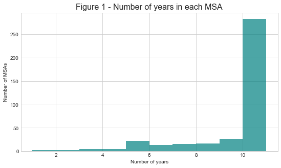
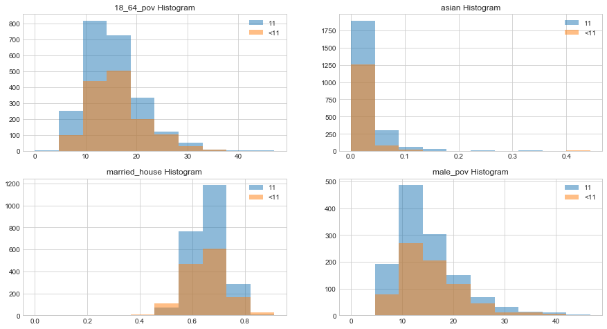
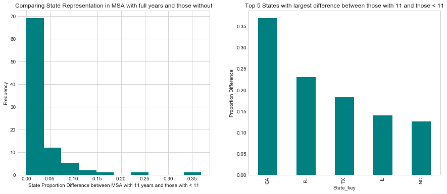
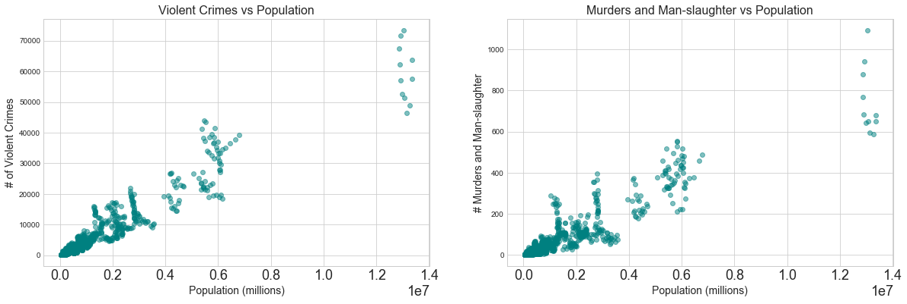
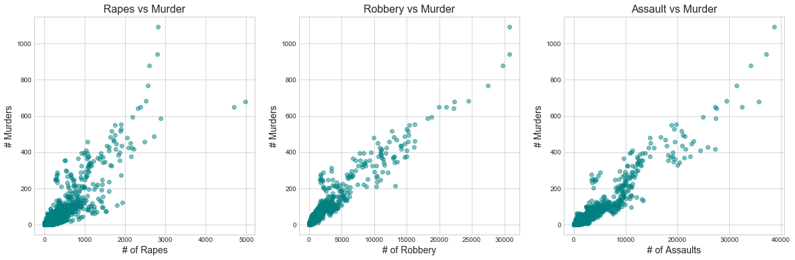
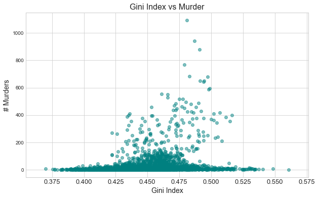
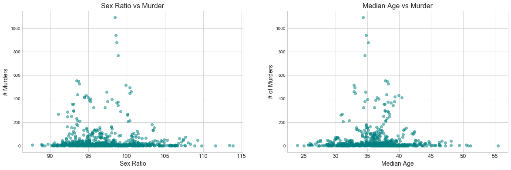
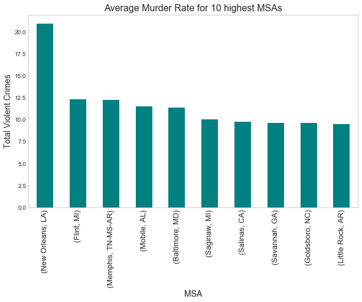
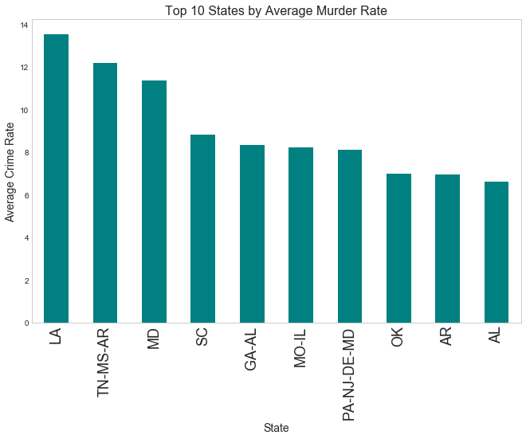
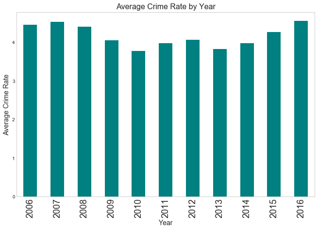

### Part 1. Examining Data Completeness by Year###

The distribution of the number of years within an MSA (Figure 1) shows that close to 75% of the MSAs have data for all 11 years. We also compared the distributions of all features for MSAs that have all 11 years vs the ones that don't (Figure 2). The distributions look very similar.


```python
# Load in final dataframe without imputed values
final_df = pd.read_json("output/final.json")
print("Total # of MSAs: %i" %len(final_df['join_key'].unique()))
#Plot a histogram by number of years
fig, ax = plt.subplots(1,1, figsize=(9,5))
final_df['num_years'] = final_df.groupby('join_key')['year'].transform(len)
groups = final_df.loc[:, ['join_key', 'num_years']].drop_duplicates()
ax.hist(groups['num_years'], color='teal', alpha=0.7)
ax.set_title('Figure 1 - Number of years in each MSA',fontsize=16)
ax.set_xlabel('Number of years')
ax.set_ylabel('Number of MSAs');

# Consider only MSAs with all 11 years of data
full_msa = final_df.num_years == 11
```


    Total # of MSAs: 392





```python
# Look at Differences for MSA that have all years and ones that do not
fig, ax = plt.subplots(2,2, figsize=(15,8))
ax = ax.flatten()

graph_vars = [v for v in final_df.columns 
              if "state_" not in v and "MSA_" not in v and 'year' not in v]
graph_vars = ['18_64_pov','asian','married_house','male_pov']

for i, v in enumerate(graph_vars):
    if v not in ['city_key', 'MSA', 'state_key', 'join_key', 'largest_city']:
        compare_msa(v, ax[i], final_df.loc[:, v].max())
print('Figure 2 - Distribution Comparisons - MSAs with 11 years vs MSAs without 11 years')
```


    Figure 2 - Distribution Comparisons - MSAs with 11 years vs MSAs without 11 years





We also examined the distribution of states between MSA with full years against MSAs with 11 than 11 years of data.  Based on the plots in Figure 3 there is no clear sytematic difference between those that have 11 and those that do not. Because our rolling window cross validation needs lots of years, **we are going to scope our analysis those MSAs that have all 11 years**


```python
# Look at Differences by states
msa_11 =  final_df.loc[full_msa, ['city_key', 'state_key']].drop_duplicates()
msa_11_counts = msa_11.state_key.value_counts()
msa_11_pct  = pd.DataFrame(msa_11_counts / len(msa_11_counts))
msa_11_pct = msa_11_pct.rename(index=str, columns={'state_key': 'prop_11'})

msa_lt_11 =  final_df.loc[~full_msa, ['city_key', 'state_key']].drop_duplicates()
msa_lt_11_counts = msa_lt_11.state_key.value_counts()
msa_lt_pct = pd.DataFrame(msa_lt_11_counts / len(msa_lt_11_counts))
msa_lt_pct = msa_lt_pct.rename(index=str, columns={'state_key': 'prop_lt_11'})

compare = msa_11_pct.join(msa_lt_pct, how='outer')
compare.loc[compare.prop_11.isnull(), 'prop_11'] = 0
compare.loc[compare.prop_lt_11.isnull(), 'prop_lt_11'] = 0
compare['diff'] = abs(compare['prop_11'] - compare['prop_lt_11'])
fig, ax = plt.subplots(1,2, figsize=(15,6))
ax[0].set_xlabel("State Proportion Difference between MSA with 11 years and those with < 11")
ax[0].set_ylabel("Frequency")
ax[0].set_title("Comparing State Representation in MSA with full years and those without")
ax[0].hist(compare['diff'], color='teal');

ax[1].set_xlabel("State_key")
ax[1].set_ylabel("Proportion Difference")
ax[1].set_title("Top 5 States with largest difference between those with 11 and those < 11")
ax[1] = compare.sort_values("diff", ascending=False).iloc[0:5, 2].plot(kind='bar', color='teal', grid=False)
#compare.head(100)
```





### Part 2. Data Exploration of Relevant Features###

In this section, we present the Exploratory Data Analysis (EDA) conducted to identify plausible relationships between number of murders and different MSA features.

### 1. MSA Population###

We could see a strong positive association between number of murders and population. In other words, **highly populated MSAs have higher number of murders.** 


```python
fig, ax = plt.subplots(1,1, figsize=(10,7))
"""
x_y_scatter(final_df['msa_pop'],
           final_df['violent_crime'],
           x_label='Population (millions)',
           y_label='# of Violent Crimes',
           title='Violent Crimes vs Population',
           ax=ax[0])
"""
x_y_scatter(final_df['msa_pop'],
           final_df['mur_mans'],
           x_label='Population (millions)',
           y_label='# Murders and Man-slaughter',
           title='Murders and Man-slaughter vs Population',
           ax=ax)
```





### 2. Other Crimes###

MSAs with high counts for other violent crimes (such as rape, robbery and aggravated assault) tend to have a high murder count


```python
sns.set_style("whitegrid")
fig, ax = plt.subplots(1,3,figsize=(20,6))

# Rape
x_y_scatter(final_df['rape'],
           final_df['mur_mans'],
           x_label='# of Rapes',
           y_label='# Murders',
           title='Rapes vs Murder',
           ax=ax[0])

# Robbery
x_y_scatter(final_df['robbery'],
           final_df['mur_mans'],
           x_label='# of Robbery',
           y_label='# Murders',
           title='Robbery vs Murder',
           ax=ax[1])
# Assault
x_y_scatter(final_df['assault'],
           final_df['mur_mans'],
           x_label='# of Assaults',
           y_label='# Murders',
           title='Assault vs Murder',
           ax=ax[2])

label_size = 13
matplotlib.rcParams['xtick.labelsize'] = label_size
plt.savefig('Murder Other crimes', bbox_inches='tight')
```





### 3. Gini Index###

Gini Index is a measure of economic inequality within an MSA and we observed a strong pattern for cases where annual mruder count is greater than 200.


```python
fig, ax = plt.subplots(1, 1, figsize=(10,6))
x_y_scatter(final_df['gini'],
           final_df['mur_mans'],
           x_label='Gini Index',
           y_label='# Murders',
           title='Gini Index vs Murder',
           ax=ax)
```





### 4. Remaining Fields###

We examined all the remaining features against number of murders and could not find a strong correlation. The scatter plots reflect the distribution of the features in the data set.

*Note: We are presenting only the most relevant findings here. Thorough examination of all the features against response was performed in detail.Additional examples and plots are included in the notebook*


```python
fig, ax = plt.subplots(1,2,figsize=(20,6))
x_y_scatter(final_df['sex_ratio'],
           final_df['mur_mans'],
           x_label='Sex Ratio',
           y_label='# Murders',
           title='Sex Ratio vs Murder',
           ax=ax[0])
x_y_scatter(final_df['median_age'],
           final_df['mur_mans'],
           x_label='Median Age',
           y_label='# of Murders',
           title='Median Age vs Murder',
           ax=ax[1])
```





### Part 3. Murder Rate Evaluation by MSA, State and Year###

**MSA**

Upon examining the average crime rate across all years for all MSAs, we discovered that **New Orleans, LA** has the highest crime rate.


```python
fig, ax = plt.subplots(1, 1, figsize=(10, 6))
ax = final_df.groupby(['city_key', 'state_key'])['rate_mur_mans'].mean().sort_values(
    ascending=False).iloc[0:10].plot(kind='bar', color='teal', grid=False)
ax.set_title('Average Murder Rate for 10 highest MSAs', fontsize=16)
ax.set_xlabel('MSA', fontsize=14)
ax.set_ylabel('Total Violent Crimes',fontsize=14);
```





**State**

**California** has the highest average crime rate across all 11 years.


```python
label_size = 18
matplotlib.rcParams['xtick.labelsize'] = label_size 
fig, ax = plt.subplots(1,1, figsize=(11,7))
ax=final_df.groupby('state_key')['rate_mur_mans'].mean().sort_values(
    ascending=False).iloc[0:10].plot(kind='bar',grid=False, color='teal')
ax.set_title('Top 10 States by Average Murder Rate', fontsize=16)
ax.set_xlabel('State', fontsize=14)
ax.set_ylabel('Average Crime Rate',fontsize=14)
plt.savefig('State_vs_Avg_Crime_rate', bbox_inches='tight')
```





**Years**

On an average, all years seem to have a consistent crime rate. However, it is interesting to see a dip for 2010 and again in 2013. This dip attributes to missing data for these years.


```python
fig, ax = plt.subplots(1,1, figsize=(11,7))
ax=final_df.sort_values("year").groupby('year')['rate_mur_mans'].mean().plot(kind='bar',grid=False, color='teal')
ax.set_title('Average Crime Rate by Year', fontsize=16)
ax.set_xlabel('Year', fontsize=14)
ax.set_ylabel('Average Crime Rate',fontsize=14);
```




