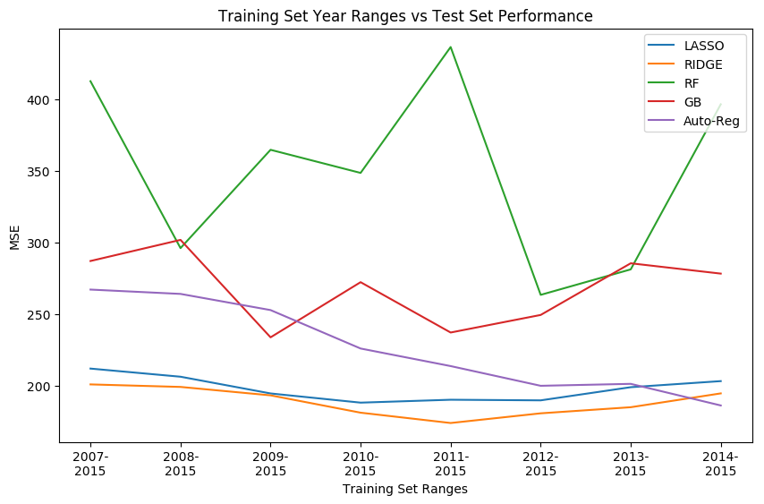
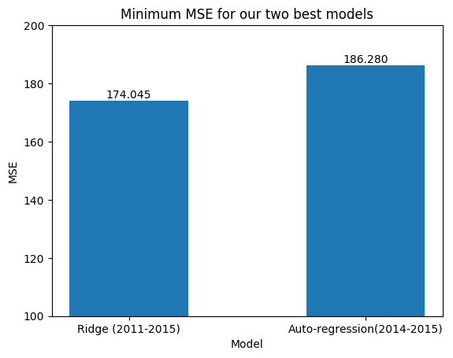

### Model Rationale and Project Trajectory

As elaborated in the introduction, we picked crime data because crime and murder prediction is an important problem to solve. An algorithm that can predict future murder can be a huge asset to state and local governments.Ultimately, we focused on trying to predict the most recent year, and thus chose 2016 to be our test set.

Next, we chose models. We decided to cross validate and tune hyper parameters on regression models that we used in this class: **Lasso, Ridge, Random Forest, and Graident Boosting.** However, we needed a baseline for model comparison. 

<u> Baseline </u>

We chose a simple **auto-regressive model** to service as our baseline. For year t,


 $$ Murder_t = B_0 + B_1 Murder_{t-1} $$


<u> Features </u>

We decided to use all of the features which met the imputation threshold (*see Data Sources Page for details*). This included crime variables, census variables, GDP, one-hot encoded State, MSA and year variables. We will let regularization and tree methods select the features that are most important.  **The only features that we drop are those that are transformations/related to murder: murder rate, number of violent crimes (since it is the sum of murder and all the other crime variables), city murder, violent crime rate, and city violent crime.**


<u> Use of Lags</u>

We decided to include the previous year's number of murders as a feature. This is standard in time series prediction, but it makes sense for us to have to eliminate 2006, so our training set becomes 2007-2015.
 
<u> Metrics </u>
 
In order to compare models, we need a metric. We decided not to use R<sup>2</sup> after realizing that it was inappropriate. Without any effort, we were getting extremely high R<sup>2</sup> and this is because TSS (Total Sum of Squares Error) will be extremely high as it pulls a mean out of the entire sample which will vary widely by MSA. Instead we chose to compare MSE. As a result, the ratio of between RSS and TSS will very low and R<sup>2</sup> will be very high. Instead, we chose to compare model performance using mean squared error on the test set. 
 
<u> Hyper-parameter tuning </u>
 
Lasso/Ridge - We cross-validated on the regularization parameter.  Note that we tried to perform scaling (standardization and normalization) but this resulted in inferior performance. This was due to the fact that distribution on train and test data was not the same which was leading to extremely poor performance on the transformed test set, so we chose to cross validate without standardizing/normalizing. However, we recognize that this made interpreting coefficients much more difficult as the features had different scales.

Random Forest - We cross-validated on the number of trees. Additionally, we set the bootstrap parameter false as we did not feel that bootstrapping was valid in the time series context.  Additionally, because we didn’t have a wide variety of features that were correlated with murder, we set max features equal to the number of features. This resulted in more correlated trees, but avoids trees constructed solely with poor features.

Gradient Boosting - Any deviations in learning rate from 0.1 resulted in horrendous performance. So we fixed learning rate and cross validated on the depth of each tree used during boosting.

 
 <u> Cross Validation Strategy </u> 
 
Because we were interested in using past data to predict future data, we couldn’t use a simple train-test split. Instead, we implemented a rolling window cross validation strategy. This is a time-series variation of leave one out cross validation. In this iterative approach you increase the training set by one year each iteration and your validation window rolls back in time.

In our context, this would mean training on 2007, validating on 2008-2015 in the first iteration, training on 2007-2008, validating on 2009-2015 in the following iteration and taking the average of each validation error at the end.

However, since our focus is to predict the most recent year, we modified the rolling window. We restricted the validation set to only be a single year, and we set our validation window range to be  2010-2015. We do this to help simulate our goal which is to use preceding data to predict the most recent year.

So, our modified rolling window was: Train on 2007-2009 Validate on 2010 Train on 2008-2010 Validate on 2011 etc
For model above, we picked the parameter that gave the lowest average validation MSE. We then fit that model on the entire training set and recorded the MSE on the test set predictions.

 
 <u> Do early years matter? </u>
 
 Finally, we also wanted to test whether earlier years (ie 2007, 2008) matter when it comes to predicting 2016. So, we ran a loop that increased the first year of training each iteration. This table illustrates the first two iterations.


|          Iteration          | Training Set Range|
|--------------------------------|----------------------------------------------------------------------|
| 1 |2007 - 2015
| 2 |2008 - 2015


Within each loop we found the optimal parameter using rolling window cross validation, fitted the model on the restricted training set year range using that best model and reported test set performance. This allowed us to compare models within each training set range and see how models performed using different training set ranges, which was one of our goals of this project. 


### This plot looks at different models performance on test set as a function of first year of training data


```python
fig, ax = plt.subplots(1,1, figsize=(10,6))
for k in test_errors.keys():
    ax.plot(test_errors[k], label=k)
# Plot Auto Regressive
ax.plot(auto_reg_results, label="Auto-Reg")

ax.set_title("Training Set Year Ranges vs Test Set Performance")
ax.set_xlabel("Training Set Ranges")
ax.set_ylabel("MSE")
ax.set_xticks(np.arange(8))
xlabels=['2007-\n2015', '2008-\n2015', '2009-\n2015',
         '2010-\n2015', '2011-\n2015', '2012-\n2015',
         '2013-\n2015', '2014-\n2015']
ax.set_xticklabels(xlabels)
ax.legend(loc='best')
plt.show()
```





```python
bar_errors = [np.min(test_errors['RIDGE']), 
              np.min(auto_reg_results)]
num_bars = np.arange(2)
plt.bar(num_bars, bar_errors, width=0.5)
plt.ylabel("MSE")
plt.xlabel("Model")
plt.xticks(num_bars, ['Ridge (2011-2015)', 'Auto-regression(2014-2015)'])
plt.title('Minimum MSE for our two best models')
plt.ylim(100, 200)
for x, height in enumerate(bar_errors):
    plt.text(x, height, '%0.3f' %height, ha='center', va='bottom')
plt.show()
```

